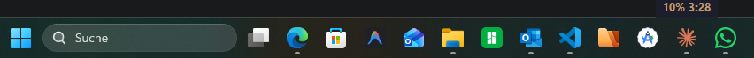

# Claude Usage Widget

A lightweight Windows taskbar widget that displays your Claude plan usage percentage and reset countdown timer.



Inspired by [cltray](https://github.com/fluke9/cltray).

## How it works

- Reads your OAuth token from Claude Code's credentials file (`~/.claude/.credentials.json`)
- Calls `https://api.anthropic.com/api/oauth/usage` every 3 minutes
- Displays the 5-hour session usage % and time until reset
- Sits just above your Windows taskbar, draggable horizontally

## Requirements

- Windows 11
- Python 3.12+
- [Claude Code](https://docs.anthropic.com/en/docs/claude-code) (provides the OAuth credentials)

## Install

```
pip install requests
```

## Run

```
python claude_tray.py
```

### Auto-start with Windows

Copy `claude_widget.vbs` to your Startup folder:

```
copy claude_widget.vbs "%APPDATA%\Microsoft\Windows\Start Menu\Programs\Startup\"
```

Edit the paths inside `claude_widget.vbs` to match your Python and project locations.

## Usage

- **Drag** to reposition horizontally
- **Double-click** to refresh
- **Right-click** for menu (Refresh / Quit)

## Color

Uses Claude's brand color (`#D4A574`). The widget shows `API busy, retrying...` if rate limited, or `Token expired` if you need to re-authenticate Claude Code.
